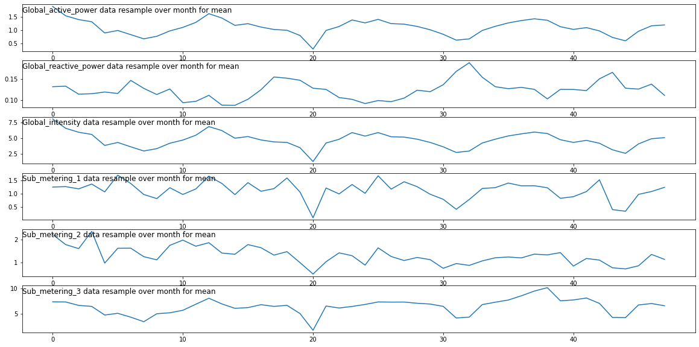
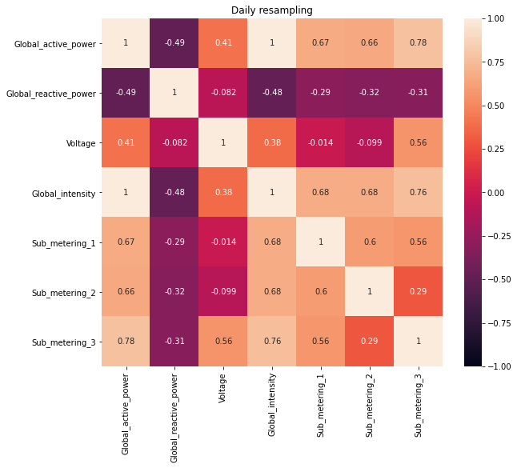
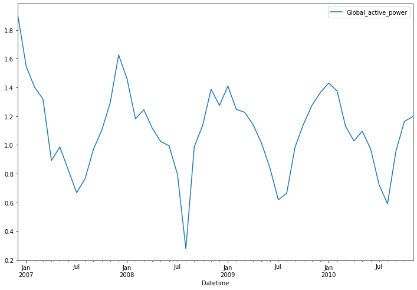
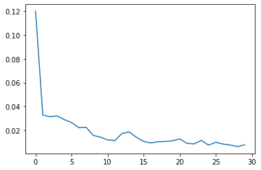
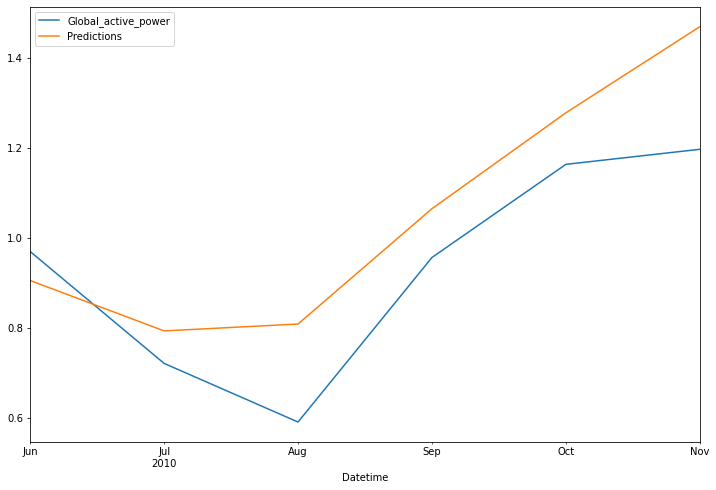
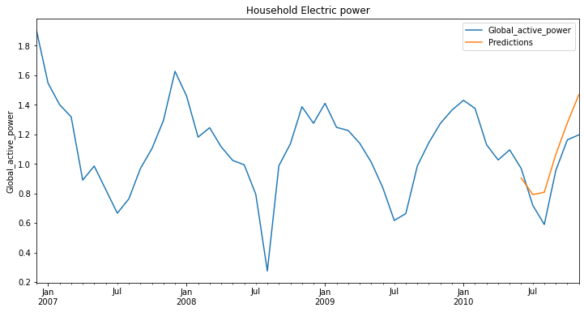
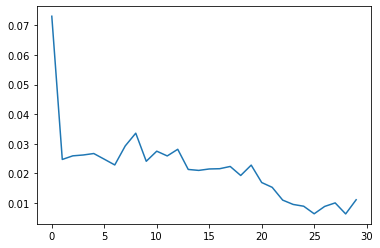
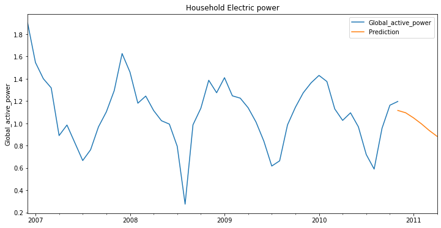

# Forecasting Household Electric Power using Keras
***
Dataset source: https://www.kaggle.com/uciml/electric-power-consumption-data-set

## Importing Library and Dataset


```python
import pandas as pd
import numpy as np
```


```python
df = pd.read_csv('household_power_consumption.txt', sep=';', 
                 parse_dates={'Datetime' : ['Date', 'Time']}, infer_datetime_format=True, 
                 index_col='Datetime', low_memory=False, na_values=['nan','?'])

df.head()
```


<div>
<style scoped>
    .dataframe tbody tr th:only-of-type {
        vertical-align: middle;
    }

    .dataframe tbody tr th {
        vertical-align: top;
    }

    .dataframe thead th {
        text-align: right;
    }
</style>
<table border="1" class="dataframe">
  <thead>
    <tr style="text-align: right;">
      <th></th>
      <th>Global_active_power</th>
      <th>Global_reactive_power</th>
      <th>Voltage</th>
      <th>Global_intensity</th>
      <th>Sub_metering_1</th>
      <th>Sub_metering_2</th>
      <th>Sub_metering_3</th>
    </tr>
    <tr>
      <th>Datetime</th>
      <th></th>
      <th></th>
      <th></th>
      <th></th>
      <th></th>
      <th></th>
      <th></th>
    </tr>
  </thead>
  <tbody>
    <tr>
      <th>2006-12-16 17:24:00</th>
      <td>4.216</td>
      <td>0.418</td>
      <td>234.84</td>
      <td>18.4</td>
      <td>0.0</td>
      <td>1.0</td>
      <td>17.0</td>
    </tr>
    <tr>
      <th>2006-12-16 17:25:00</th>
      <td>5.360</td>
      <td>0.436</td>
      <td>233.63</td>
      <td>23.0</td>
      <td>0.0</td>
      <td>1.0</td>
      <td>16.0</td>
    </tr>
    <tr>
      <th>2006-12-16 17:26:00</th>
      <td>5.374</td>
      <td>0.498</td>
      <td>233.29</td>
      <td>23.0</td>
      <td>0.0</td>
      <td>2.0</td>
      <td>17.0</td>
    </tr>
    <tr>
      <th>2006-12-16 17:27:00</th>
      <td>5.388</td>
      <td>0.502</td>
      <td>233.74</td>
      <td>23.0</td>
      <td>0.0</td>
      <td>1.0</td>
      <td>17.0</td>
    </tr>
    <tr>
      <th>2006-12-16 17:28:00</th>
      <td>3.666</td>
      <td>0.528</td>
      <td>235.68</td>
      <td>15.8</td>
      <td>0.0</td>
      <td>1.0</td>
      <td>17.0</td>
    </tr>
  </tbody>
</table>
</div>


## Data Preprocessing


```python
print(f'There are {df.shape[0]} number of rows and {df.shape[1]} number of columns\n')
print(f'Columns with NULL:\n{df.isnull().sum()}')
```

    There are 2075259 number of rows and 7 number of columns
    
    Columns with NULL:
    Global_active_power      25979
    Global_reactive_power    25979
    Voltage                  25979
    Global_intensity         25979
    Sub_metering_1           25979
    Sub_metering_2           25979
    Sub_metering_3           25979
    dtype: int64
    


```python
df.dropna(inplace=True)
print(f'There are {df.shape[0]} number of rows and {df.shape[1]} number of columns\n')
print(f'Columns with NULL:\n{df.isnull().sum()}')
```

    There are 2049280 number of rows and 7 number of columns
    
    Columns with NULL:
    Global_active_power      0
    Global_reactive_power    0
    Voltage                  0
    Global_intensity         0
    Sub_metering_1           0
    Sub_metering_2           0
    Sub_metering_3           0
    dtype: int64
    

## Exploratory Data Analysis
***

<table style="display: inline-block">
    <caption style="text-align: center"><strong>TIME SERIES OFFSET ALIASES</strong></caption>
<tr><th>ALIAS</th><th>DESCRIPTION</th></tr>
<tr><td>B</td><td>business day frequency</td></tr>
<tr><td>C</td><td>custom business day frequency (experimental)</td></tr>
<tr><td>D</td><td>calendar day frequency</td></tr>
<tr><td>W</td><td>weekly frequency</td></tr>
<tr><td>M</td><td>month end frequency</td></tr>
<tr><td>SM</td><td>semi-month end frequency (15th and end of month)</td></tr>
<tr><td>BM</td><td>business month end frequency</td></tr>
<tr><td>CBM</td><td>custom business month end frequency</td></tr>
<tr><td>MS</td><td>month start frequency</td></tr>
<tr><td>SMS</td><td>semi-month start frequency (1st and 15th)</td></tr>
<tr><td>BMS</td><td>business month start frequency</td></tr>
<tr><td>CBMS</td><td>custom business month start frequency</td></tr>
<tr><td>Q</td><td>quarter end frequency</td></tr>
<tr><td></td><td><font color=white>intentionally left blank</font></td></tr></table>

<table style="display: inline-block; margin-left: 40px">
<caption style="text-align: center"></caption>
<tr><th>ALIAS</th><th>DESCRIPTION</th></tr>
<tr><td>BQ</td><td>business quarter endfrequency</td></tr>
<tr><td>QS</td><td>quarter start frequency</td></tr>
<tr><td>BQS</td><td>business quarter start frequency</td></tr>
<tr><td>A</td><td>year end frequency</td></tr>
<tr><td>BA</td><td>business year end frequency</td></tr>
<tr><td>AS</td><td>year start frequency</td></tr>
<tr><td>BAS</td><td>business year start frequency</td></tr>
<tr><td>BH</td><td>business hour frequency</td></tr>
<tr><td>H</td><td>hourly frequency</td></tr>
<tr><td>T, min</td><td>minutely frequency</td></tr>
<tr><td>S</td><td>secondly frequency</td></tr>
<tr><td>L, ms</td><td>milliseconds</td></tr>
<tr><td>U, us</td><td>microseconds</td></tr>
<tr><td>N</td><td>nanoseconds</td></tr></table>

Above is the rule argument for resample()


### Plot out each column with monthly time series


```python
import matplotlib.pyplot as plt

i = 1
cols=[0, 1, 3, 4, 5, 6]
plt.figure(figsize=(20, 10))
for col in cols:
    plt.subplot(len(cols), 1, i)
    plt.plot(df.resample('M').mean().values[:, col])
    plt.title(df.columns[col] + ' data resample over month for mean', y=0.75, loc='left')
    i += 1
plt.show()
```

    In C:\Users\Jerem\Anaconda3\envs\tsa_course\lib\site-packages\matplotlib\mpl-data\stylelib\_classic_test.mplstyle: 
    The savefig.frameon rcparam was deprecated in Matplotlib 3.1 and will be removed in 3.3.
    In C:\Users\Jerem\Anaconda3\envs\tsa_course\lib\site-packages\matplotlib\mpl-data\stylelib\_classic_test.mplstyle: 
    The verbose.level rcparam was deprecated in Matplotlib 3.1 and will be removed in 3.3.
    In C:\Users\Jerem\Anaconda3\envs\tsa_course\lib\site-packages\matplotlib\mpl-data\stylelib\_classic_test.mplstyle: 
    The verbose.fileo rcparam was deprecated in Matplotlib 3.1 and will be removed in 3.3.
    


    

    


### Check if there are any correlations among the columns


```python
df.corr()
```


<div>
<style scoped>
    .dataframe tbody tr th:only-of-type {
        vertical-align: middle;
    }

    .dataframe tbody tr th {
        vertical-align: top;
    }

    .dataframe thead th {
        text-align: right;
    }
</style>
<table border="1" class="dataframe">
  <thead>
    <tr style="text-align: right;">
      <th></th>
      <th>Global_active_power</th>
      <th>Global_reactive_power</th>
      <th>Voltage</th>
      <th>Global_intensity</th>
      <th>Sub_metering_1</th>
      <th>Sub_metering_2</th>
      <th>Sub_metering_3</th>
    </tr>
  </thead>
  <tbody>
    <tr>
      <th>Global_active_power</th>
      <td>1.000000</td>
      <td>0.247017</td>
      <td>-0.399762</td>
      <td>0.998889</td>
      <td>0.484401</td>
      <td>0.434569</td>
      <td>0.638555</td>
    </tr>
    <tr>
      <th>Global_reactive_power</th>
      <td>0.247017</td>
      <td>1.000000</td>
      <td>-0.112246</td>
      <td>0.266120</td>
      <td>0.123111</td>
      <td>0.139231</td>
      <td>0.089617</td>
    </tr>
    <tr>
      <th>Voltage</th>
      <td>-0.399762</td>
      <td>-0.112246</td>
      <td>1.000000</td>
      <td>-0.411363</td>
      <td>-0.195976</td>
      <td>-0.167405</td>
      <td>-0.268172</td>
    </tr>
    <tr>
      <th>Global_intensity</th>
      <td>0.998889</td>
      <td>0.266120</td>
      <td>-0.411363</td>
      <td>1.000000</td>
      <td>0.489298</td>
      <td>0.440347</td>
      <td>0.626543</td>
    </tr>
    <tr>
      <th>Sub_metering_1</th>
      <td>0.484401</td>
      <td>0.123111</td>
      <td>-0.195976</td>
      <td>0.489298</td>
      <td>1.000000</td>
      <td>0.054721</td>
      <td>0.102571</td>
    </tr>
    <tr>
      <th>Sub_metering_2</th>
      <td>0.434569</td>
      <td>0.139231</td>
      <td>-0.167405</td>
      <td>0.440347</td>
      <td>0.054721</td>
      <td>1.000000</td>
      <td>0.080872</td>
    </tr>
    <tr>
      <th>Sub_metering_3</th>
      <td>0.638555</td>
      <td>0.089617</td>
      <td>-0.268172</td>
      <td>0.626543</td>
      <td>0.102571</td>
      <td>0.080872</td>
      <td>1.000000</td>
    </tr>
  </tbody>
</table>
</div>


```python
import seaborn as sns
f= plt.figure(figsize=(21,8))

ax=f.add_subplot(121)
dfd = df.resample('M').mean()
sns.heatmap(dfd.corr(), vmin=-1, vmax=1, annot=True)
plt.title('Daily resampling', size=12)
plt.show()
```


    

    


Global_active_power and Global_intensity has high correlation.

I have chosen to predict Global_active_power

# Forecasting Global_active_power using keras


```python
dfd = dfd[['Global_active_power']]
```


```python
dfd.dropna(inplace=True) #dropna as there were some null values
dfd.head()
```


<div>
<style scoped>
    .dataframe tbody tr th:only-of-type {
        vertical-align: middle;
    }

    .dataframe tbody tr th {
        vertical-align: top;
    }

    .dataframe thead th {
        text-align: right;
    }
</style>
<table border="1" class="dataframe">
  <thead>
    <tr style="text-align: right;">
      <th></th>
      <th>Global_active_power</th>
    </tr>
    <tr>
      <th>Datetime</th>
      <th></th>
    </tr>
  </thead>
  <tbody>
    <tr>
      <th>2006-12-31</th>
      <td>1.901295</td>
    </tr>
    <tr>
      <th>2007-01-31</th>
      <td>1.546034</td>
    </tr>
    <tr>
      <th>2007-02-28</th>
      <td>1.401084</td>
    </tr>
    <tr>
      <th>2007-03-31</th>
      <td>1.318627</td>
    </tr>
    <tr>
      <th>2007-04-30</th>
      <td>0.891189</td>
    </tr>
  </tbody>
</table>
</div>


```python
dfd.plot(figsize=(12,8));
```


    

    


#### Checking the length of dataframe dfd. dfd is a month resampled dataframe from df


```python
len(dfd)
```


    48


#### Split the data into a train and test where the test set is the last 6 months of data.


```python
train = dfd.iloc[:-6]
test = dfd.iloc[-6:]

len(test)
```


    6


#### Using MinMaxScaler to scale the train and test sets into scaled versions.


```python
from sklearn.preprocessing import MinMaxScaler

scaler = MinMaxScaler()
scaler.fit(train)
```


    MinMaxScaler(copy=True, feature_range=(0, 1))


```python
scaled_train = scaler.transform(train)
scaled_test = scaler.transform(test)
```

# Time Series Generator

#### Creating TimeSeriesGenerator object based off the scaled_train data. The n_input is up to you, but at a minimum it should be at least 12.


```python
from keras.preprocessing.sequence import TimeseriesGenerator

n_input = 12
n_features=1
generator = TimeseriesGenerator(scaled_train, scaled_train, length=n_input, batch_size=1)
```

### Create the Model

#### Creating Keras Sequential Model with 150 LSTM units and a final Dense Layer


```python
from keras.models import Sequential
from keras.layers import Dense
from keras.layers import LSTM
```


```python
# define model
model = Sequential()
model.add(LSTM(150, activation='relu', input_shape=(n_input, n_features)))
model.add(Dense(1))
model.compile(optimizer='adam', loss='mse')
```


```python
model.summary()
```

    Model: "sequential"
    _________________________________________________________________
    Layer (type)                 Output Shape              Param #   
    =================================================================
    lstm (LSTM)                  (None, 150)               91200     
    _________________________________________________________________
    dense (Dense)                (None, 1)                 151       
    =================================================================
    Total params: 91,351
    Trainable params: 91,351
    Non-trainable params: 0
    _________________________________________________________________
    

#### Fit the model to the generator with 30 epochs


```python
# fit model
model.fit(generator,epochs=30)
```

    Epoch 1/30
    30/30 [==============================] - 1s 3ms/step - loss: 0.2271
    Epoch 2/30
    30/30 [==============================] - 0s 3ms/step - loss: 0.0238
    Epoch 3/30
    30/30 [==============================] - 0s 3ms/step - loss: 0.0642
    Epoch 4/30
    30/30 [==============================] - 0s 3ms/step - loss: 0.0289
    Epoch 5/30
    30/30 [==============================] - 0s 3ms/step - loss: 0.0281
    Epoch 6/30
    30/30 [==============================] - 0s 3ms/step - loss: 0.0382
    Epoch 7/30
    30/30 [==============================] - 0s 3ms/step - loss: 0.0216
    Epoch 8/30
    30/30 [==============================] - 0s 3ms/step - loss: 0.0223
    Epoch 9/30
    30/30 [==============================] - 0s 3ms/step - loss: 0.0149
    Epoch 10/30
    30/30 [==============================] - 0s 3ms/step - loss: 0.0262
    Epoch 11/30
    30/30 [==============================] - 0s 3ms/step - loss: 0.0070
    Epoch 12/30
    30/30 [==============================] - 0s 3ms/step - loss: 0.0131
    Epoch 13/30
    30/30 [==============================] - 0s 3ms/step - loss: 0.0145
    Epoch 14/30
    30/30 [==============================] - 0s 3ms/step - loss: 0.0216
    Epoch 15/30
    30/30 [==============================] - 0s 3ms/step - loss: 0.0122
    Epoch 16/30
    30/30 [==============================] - 0s 3ms/step - loss: 0.0126
    Epoch 17/30
    30/30 [==============================] - 0s 3ms/step - loss: 0.0066
    Epoch 18/30
    30/30 [==============================] - 0s 3ms/step - loss: 0.0127
    Epoch 19/30
    30/30 [==============================] - 0s 3ms/step - loss: 0.0069
    Epoch 20/30
    30/30 [==============================] - 0s 3ms/step - loss: 0.0148
    Epoch 21/30
    30/30 [==============================] - 0s 3ms/step - loss: 0.0112
    Epoch 22/30
    30/30 [==============================] - 0s 3ms/step - loss: 0.0094
    Epoch 23/30
    30/30 [==============================] - 0s 3ms/step - loss: 0.0050
    Epoch 24/30
    30/30 [==============================] - 0s 3ms/step - loss: 0.0097
    Epoch 25/30
    30/30 [==============================] - 0s 3ms/step - loss: 0.0195
    Epoch 26/30
    30/30 [==============================] - 0s 3ms/step - loss: 0.0093
    Epoch 27/30
    30/30 [==============================] - 0s 3ms/step - loss: 0.0099
    Epoch 28/30
    30/30 [==============================] - 0s 3ms/step - loss: 0.0064
    Epoch 29/30
    30/30 [==============================] - 0s 3ms/step - loss: 0.0031
    Epoch 30/30
    30/30 [==============================] - 0s 3ms/step - loss: 0.0089
    


    <tensorflow.python.keras.callbacks.History at 0x15ec825ee10>


#### Plot showing the history of the loss that occured during training


```python
loss_per_epoch = model.history.history['loss']
plt.plot(range(len(loss_per_epoch)),loss_per_epoch);
```


    

    


# Evaluating model on Test Data

#### Based on test data and input size, create an appropriately sized "first evaluation batch"


```python
first_eval_batch = scaled_train[-6:]
first_eval_batch
```


    array([[0.66957642],
           [0.71026083],
           [0.67661357],
           [0.52534679],
           [0.46208997],
           [0.50393446]])


```python
first_eval_batch = first_eval_batch.reshape((1, 6, n_features))
```

#### Generate predictions into the same time stamps as the test set


```python
test_predictions = []

first_eval_batch = scaled_train[-n_input:]
current_batch = first_eval_batch.reshape((1, n_input, n_features))

for i in range(len(test)):
    
    # get prediction 1 time stamp ahead ([0] is for grabbing just the number instead of [array])
    current_pred = model.predict(current_batch)[0]
    
    # store prediction
    test_predictions.append(current_pred) 
    
    # update batch to now include prediction and drop first value
    current_batch = np.append(current_batch[:,1:,:],[[current_pred]],axis=1)
```

#### Inverse Transform forecasted predictions


```python
true_predictions = scaler.inverse_transform(test_predictions)
true_predictions
```


    array([[0.90525297],
           [0.79325198],
           [0.80860595],
           [1.0648841 ],
           [1.27791759],
           [1.4693212 ]])


#### Creating dataframe that has both the original test values and predictions


```python
test['Predictions'] = true_predictions
test
```

    C:\Users\Jerem\Anaconda3\envs\tsa_course\lib\site-packages\ipykernel_launcher.py:1: SettingWithCopyWarning: 
    A value is trying to be set on a copy of a slice from a DataFrame.
    Try using .loc[row_indexer,col_indexer] = value instead
    
    See the caveats in the documentation: https://pandas.pydata.org/pandas-docs/stable/user_guide/indexing.html#returning-a-view-versus-a-copy
      """Entry point for launching an IPython kernel.
    


<div>
<style scoped>
    .dataframe tbody tr th:only-of-type {
        vertical-align: middle;
    }

    .dataframe tbody tr th {
        vertical-align: top;
    }

    .dataframe thead th {
        text-align: right;
    }
</style>
<table border="1" class="dataframe">
  <thead>
    <tr style="text-align: right;">
      <th></th>
      <th>Global_active_power</th>
      <th>Predictions</th>
    </tr>
    <tr>
      <th>Datetime</th>
      <th></th>
      <th></th>
    </tr>
  </thead>
  <tbody>
    <tr>
      <th>2010-06-30</th>
      <td>0.969615</td>
      <td>0.905253</td>
    </tr>
    <tr>
      <th>2010-07-31</th>
      <td>0.721068</td>
      <td>0.793252</td>
    </tr>
    <tr>
      <th>2010-08-31</th>
      <td>0.590778</td>
      <td>0.808606</td>
    </tr>
    <tr>
      <th>2010-09-30</th>
      <td>0.956442</td>
      <td>1.064884</td>
    </tr>
    <tr>
      <th>2010-10-31</th>
      <td>1.163399</td>
      <td>1.277918</td>
    </tr>
    <tr>
      <th>2010-11-30</th>
      <td>1.196854</td>
      <td>1.469321</td>
    </tr>
  </tbody>
</table>
</div>


#### Plot showing the test set against predicted values


```python
test.plot(figsize=(12,8))
```


    <matplotlib.axes._subplots.AxesSubplot at 0x15ec8253470>


    

    


```python
title='Household Electric power'
ylabel='Global_active_power'
xlabel=''

ax = dfd.plot(legend=True,figsize=(12,6),title=title)
test['Predictions'].plot(legend=True)
ax.autoscale(axis='x',tight=True)
ax.set(xlabel=xlabel, ylabel=ylabel);
```


    

    


# Forecasting into the future


```python
scaler = MinMaxScaler()
dfd_scaled = scaler.fit_transform(dfd)
```


```python
n_input = 24
n_features=1
generator = TimeseriesGenerator(dfd_scaled, dfd_scaled, length=n_input, batch_size=1)
```

## Create the Model

#### Creating Keras Sequential Model with 150 LSTM units and a final Dense Layer


```python
from keras.models import Sequential
from keras.layers import Dense
from keras.layers import LSTM

# define model
model = Sequential()
model.add(LSTM(150, activation='relu', input_shape=(n_input, n_features)))
model.add(Dense(1))
model.compile(optimizer='adam', loss='mse')

model.summary()
```

    Model: "sequential_1"
    _________________________________________________________________
    Layer (type)                 Output Shape              Param #   
    =================================================================
    lstm_1 (LSTM)                (None, 150)               91200     
    _________________________________________________________________
    dense_1 (Dense)              (None, 1)                 151       
    =================================================================
    Total params: 91,351
    Trainable params: 91,351
    Non-trainable params: 0
    _________________________________________________________________
    


```python
# fit model
model.fit(generator,epochs=30)
```

    Epoch 1/30
    24/24 [==============================] - 1s 5ms/step - loss: 0.1268
    Epoch 2/30
    24/24 [==============================] - 0s 4ms/step - loss: 0.0208
    Epoch 3/30
    24/24 [==============================] - 0s 4ms/step - loss: 0.0219
    Epoch 4/30
    24/24 [==============================] - 0s 4ms/step - loss: 0.0333
    Epoch 5/30
    24/24 [==============================] - 0s 4ms/step - loss: 0.0287
    Epoch 6/30
    24/24 [==============================] - 0s 4ms/step - loss: 0.0268
    Epoch 7/30
    24/24 [==============================] - 0s 4ms/step - loss: 0.0199
    Epoch 8/30
    24/24 [==============================] - 0s 5ms/step - loss: 0.0250
    Epoch 9/30
    24/24 [==============================] - 0s 5ms/step - loss: 0.0421
    Epoch 10/30
    24/24 [==============================] - 0s 4ms/step - loss: 0.0236
    Epoch 11/30
    24/24 [==============================] - 0s 4ms/step - loss: 0.0214
    Epoch 12/30
    24/24 [==============================] - 0s 5ms/step - loss: 0.0287
    Epoch 13/30
    24/24 [==============================] - 0s 5ms/step - loss: 0.0273
    Epoch 14/30
    24/24 [==============================] - 0s 5ms/step - loss: 0.0217
    Epoch 15/30
    24/24 [==============================] - 0s 5ms/step - loss: 0.0317
    Epoch 16/30
    24/24 [==============================] - 0s 5ms/step - loss: 0.0186
    Epoch 17/30
    24/24 [==============================] - 0s 5ms/step - loss: 0.0199
    Epoch 18/30
    24/24 [==============================] - 0s 5ms/step - loss: 0.0279
    Epoch 19/30
    24/24 [==============================] - 0s 5ms/step - loss: 0.0166
    Epoch 20/30
    24/24 [==============================] - 0s 4ms/step - loss: 0.0272
    Epoch 21/30
    24/24 [==============================] - 0s 4ms/step - loss: 0.0181
    Epoch 22/30
    24/24 [==============================] - 0s 5ms/step - loss: 0.0155
    Epoch 23/30
    24/24 [==============================] - 0s 5ms/step - loss: 0.0084
    Epoch 24/30
    24/24 [==============================] - 0s 5ms/step - loss: 0.0096
    Epoch 25/30
    24/24 [==============================] - 0s 5ms/step - loss: 0.0082
    Epoch 26/30
    24/24 [==============================] - 0s 5ms/step - loss: 0.0057
    Epoch 27/30
    24/24 [==============================] - 0s 5ms/step - loss: 0.0099
    Epoch 28/30
    24/24 [==============================] - 0s 5ms/step - loss: 0.0118
    Epoch 29/30
    24/24 [==============================] - 0s 5ms/step - loss: 0.0043
    Epoch 30/30
    24/24 [==============================] - 0s 5ms/step - loss: 0.0073
    


    <tensorflow.python.keras.callbacks.History at 0x15ecb861358>


#### Plot showing the history of the loss that occured during training


```python
#Loss vs Epoch
loss_per_epoch = model.history.history['loss']
plt.plot(range(len(loss_per_epoch)),loss_per_epoch);
```


    

    


```python
first_eval_batch = scaled_train[-12:]
first_eval_batch = first_eval_batch.reshape((1, 12, n_features))
```

#### Generate predictions into the future


```python
test_predictions = []

first_eval_batch = dfd_scaled[-n_input:]
current_batch = first_eval_batch.reshape((1, n_input, n_features))

for i in range(6):
    
    # get prediction 1 time stamp ahead ([0] is for grabbing just the number instead of [array])
    current_pred = model.predict(current_batch)[0]
    
    # store prediction
    test_predictions.append(current_pred) 
    
    # update batch to now include prediction and drop first value
    current_batch = np.append(current_batch[:,1:,:],[[current_pred]],axis=1)
```

#### Inverse Transform forecasted predictions and stores it in variable true_predictions


```python
true_predictions = scaler.inverse_transform(test_predictions)
true_predictions
```


    array([[1.11664424],
           [1.09569993],
           [1.05004641],
           [0.99665151],
           [0.93658508],
           [0.88393299]])


#### Get last date from dataframe. 


```python
last_date = dfd.iloc[-1]
last_date.name
```


    Timestamp('2010-11-30 00:00:00', freq='M')


#### Create placeholder on future dates to be predicted followed by filling placeholders with true_predictions


```python
index = pd.date_range(last_date.name, periods=6, freq='M')
df_pred = pd.DataFrame(index=index, columns=['Prediction'])
df_pred['Prediction'] = true_predictions
df_pred
```


<div>
<style scoped>
    .dataframe tbody tr th:only-of-type {
        vertical-align: middle;
    }

    .dataframe tbody tr th {
        vertical-align: top;
    }

    .dataframe thead th {
        text-align: right;
    }
</style>
<table border="1" class="dataframe">
  <thead>
    <tr style="text-align: right;">
      <th></th>
      <th>Prediction</th>
    </tr>
  </thead>
  <tbody>
    <tr>
      <th>2010-11-30</th>
      <td>1.116644</td>
    </tr>
    <tr>
      <th>2010-12-31</th>
      <td>1.095700</td>
    </tr>
    <tr>
      <th>2011-01-31</th>
      <td>1.050046</td>
    </tr>
    <tr>
      <th>2011-02-28</th>
      <td>0.996652</td>
    </tr>
    <tr>
      <th>2011-03-31</th>
      <td>0.936585</td>
    </tr>
    <tr>
      <th>2011-04-30</th>
      <td>0.883933</td>
    </tr>
  </tbody>
</table>
</div>


#### Plot showing the forecast into the future


```python
title='Household Electric power'
ylabel='Global_active_power'
xlabel=''

ax = dfd.plot(legend=True,figsize=(12,6),title=title)
df_pred['Prediction'].plot(legend=True)
ax.autoscale(axis='x',tight=True)
ax.set(xlabel=xlabel, ylabel=ylabel);
```


    

    


```python

```
